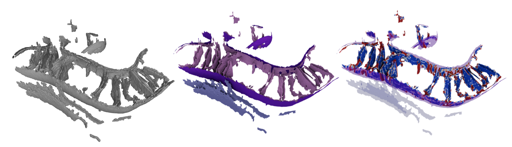

# About Surface Morphometrics GUI

## Project Overview

The Surface Morphometrics GUI is a graphical user interface for the Surface Morphometrics toolkit, designed to simplify the quantitative analysis of 3D surface meshes from cryo-electron tomography (cryo-ET). This tool provides researchers with an accessible interface for complex geometric analysis without requiring command-line programming expertise.

## What is Surface Morphometrics?

Surface morphometrics is the quantitative analysis of surface geometry and topology, specifically focused on biological membranes and cellular structures. The toolkit generates robust open mesh surfaces from voxel segmentations and calculates morphological features including:

- **Curvature Analysis**: Gaussian, mean, and principal curvatures using pycurv's vector voting framework
- **Distance Measurements**: Intra- and inter-surface distances and orientations
- **Topological Features**: Surface connectivity and structural relationships

## Technical Architecture

### Core Components
The GUI provides access to the underlying Surface Morphometrics toolkit:

- **Mesh Generation**: Robust surface reconstruction using Screened Poisson algorithm
- **Curvature Calculation**: Pycurv-based vector voting framework for accurate curvature measurement
- **Distance Analysis**: Intra- and inter-surface distance and orientation calculations
- **3D Visualization**: Interactive 3D rendering of surfaces and quantification results
