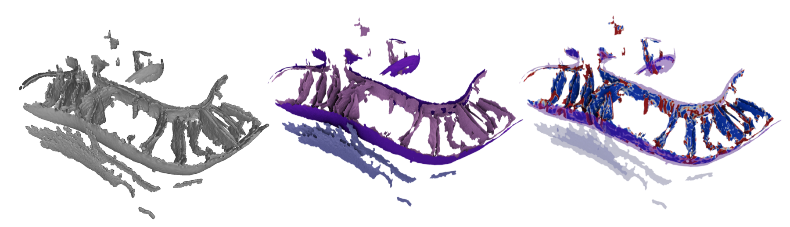

# About

## What is surface morphometrics?

Surface morphometrics is the quantitative analysis of surface geometry and topology in biological membranes and cellular structures. Starting from voxel segmentations of cryo-electron tomography (cryo-ET) data, the pipeline generates surface meshes and computes morphological measurements.

## Core components

| Component | What it does |
|-----------|--------------|
| **Mesh Generation** | Converts voxel segmentations into surface meshes using screened Poisson reconstruction |
| **PyCurv** | Computes curvature measurements using a vector voting framework |
| **Distance & Orientation** | Measures distances and relative orientations between surfaces |
| **3D Visualization** | Interactive rendering of surfaces with property colormaps |

## References

- **Original pipeline**: [surface_morphometrics](https://github.com/GrotjahnLab/surface_morphometrics) by the Grotjahn Lab
- **Paper**: Barad et al. (2023) — Quantitative analysis of membrane ultrastructure using cryo-ET surface morphometrics
