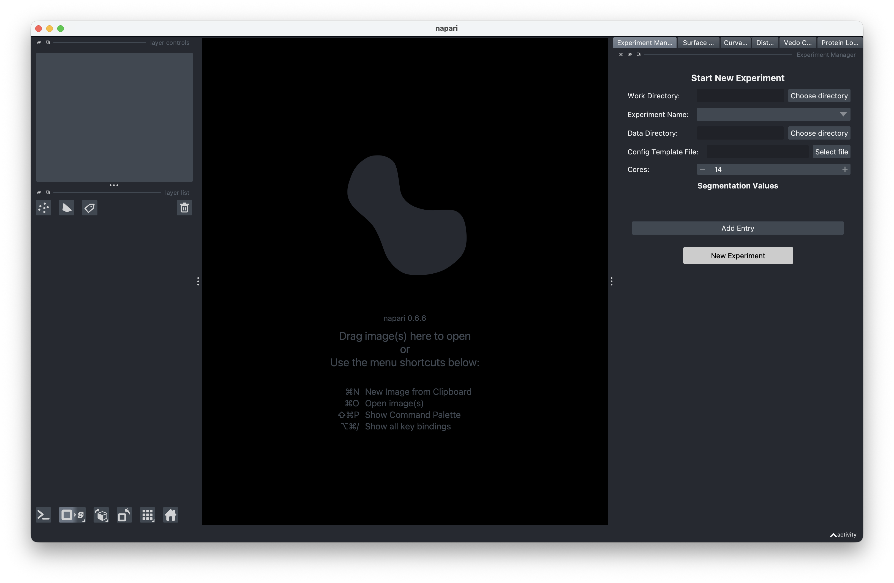
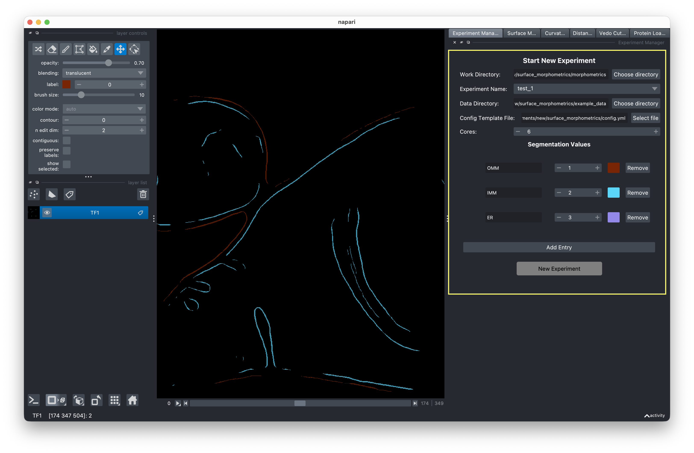
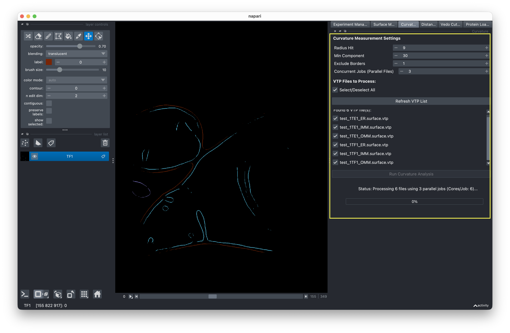

# Quick Start

This walkthrough takes you from launching the GUI to viewing your first results. For detailed explanations of each step, see the [User Guide](../guide/experiment-setup.md).

## 1. Launch the GUI

```bash
conda activate morphometrics
cd surface-morphometrics-gui/src
python main.py
```


<!-- IMAGE NEEDED: Screenshot of the GUI on first launch, showing the empty state with the experiment manager panel on the right -->

## 2. Create an experiment

In the experiment manager panel (right side):

1. Set a **Work Directory** — where experiment folders will be created
2. Enter an **Experiment Name**
3. Select your **Data Directory** — the folder with your segmentation files
4. Choose a **Config Template** — a YAML file from the `surface_morphometrics` directory

    !!! warning "Config template location matters"
        The GUI detects analysis scripts based on where your config template is located. **Keep your config template inside the `surface_morphometrics` directory** (the repository containing the pipeline scripts). If you move it elsewhere, the GUI will not find the scripts.

5. Set the number of **Cores** for parallel processing
6. Review the **Segmentation Values** populated from the template
7. Click **New Experiment**

<!-- IMAGE NEEDED: Screenshot of the experiment manager panel with all fields filled in — Work Directory path, an Experiment Name entered, Data Directory selected, a Config Template YAML loaded, Cores set, and Segmentation Values populated below. The "New Experiment" button should be enabled -->



## 3. Generate surface meshes

Switch to the **Mesh Generation** tab:

1. Review the mesh generation settings
2. Click **Run** to generate surface meshes from your segmentations

<!-- IMAGE NEEDED: Screenshot of the Mesh Generation tab on the right side, showing the mesh generation settings (reconstruction depth, surface quality parameters) and the Run button, with the progress bar visible at the bottom -->


## 4. Run curvature analysis

Switch to the **PyCurv** tab:

1. Select the VTP files to analyze (or use **Select All**)
2. Click **Run** to compute curvature measurements

<!-- IMAGE NEEDED: Screenshot of the PyCurv tab showing the curvature settings (Radius Hit, Min Component, Exclude Borders, Concurrent Jobs), the VTP file list with checkboxes and Select All option, and the Run button -->



## 5. Measure distances and orientations

Switch to the **Distance & Orientation** tab:

1. Configure intra-membrane and inter-membrane measurement pairs
2. Click **Run** to compute distances and orientations

<!-- IMAGE NEEDED: Screenshot of the Distance & Orientation tab showing intra-membrane and inter-membrane measurement configuration sections, the Concurrent Jobs spinner, and the Run button -->


## 6. Visualize results

Use the visualization panel on the left side to:

- Preview your dataset with the tomogram slice viewer
- Load and rotate meshes in 3D
- Color surfaces by curvature, distance, or other properties
- Load protein structures onto meshes

<!-- IMAGE NEEDED: Screenshot of the visualization panel showing a 3D rendered mesh colored by a curvature property, with the property dropdown and contrast slider visible -->

## Next steps

See the [User Guide](../guide/experiment-setup.md) for detailed explanations of each step, including configuration options and tips for getting the best results.
