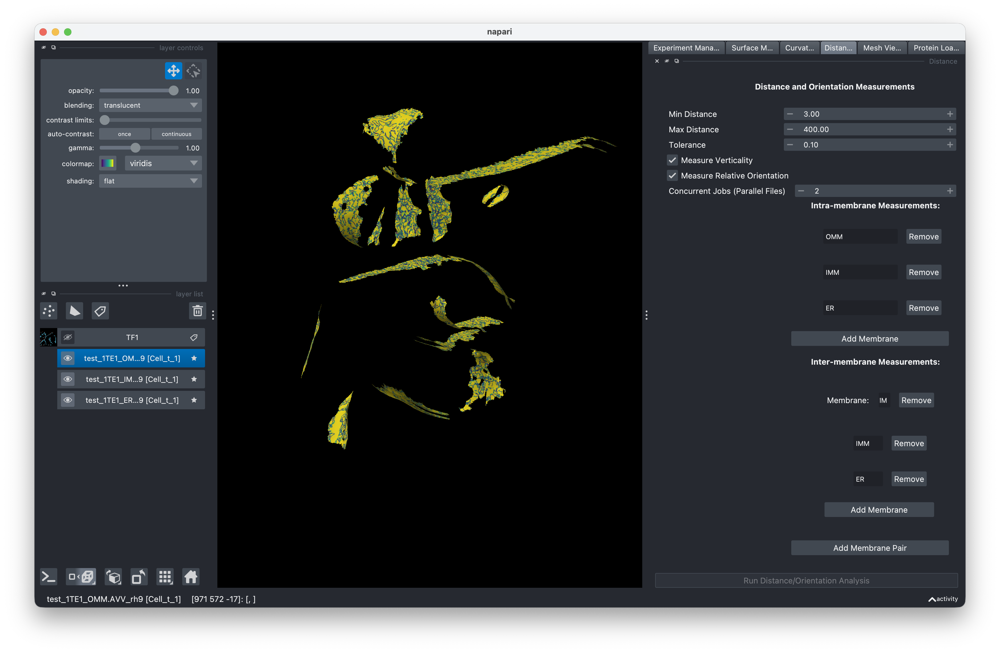

# Distance & Orientation

This step measures distances and relative orientations between membrane surfaces. You can measure within a single membrane (intra) or between two different membranes (inter).

<!-- IMAGE NEEDED: Screenshot of the Distance & Orientation tab showing the intra-membrane and inter-membrane measurement configuration sections, the Concurrent Jobs spinner, and the Run button -->

## Setting up measurements

### Intra-membrane measurements

Intra-membrane measurements compute distances and orientations within a single membrane surface (e.g., measuring membrane thickness or local curvature-related distances).

### Inter-membrane measurements

Inter-membrane measurements compute distances and orientations between pairs of membrane surfaces. You define which surfaces to compare by setting up measurement pairs.

## Parallel processing (Workers)

Like the PyCurv tab, Distance & Orientation supports parallel file processing through the **Concurrent Jobs** spinner.

- **Concurrent Jobs** controls how many measurement scripts run simultaneously. Each job processes one file at a time.
- Distance scripts are single-threaded (1 core per job), so the total CPU load equals the number of concurrent jobs.

!!! tip
    Since distance scripts use only 1 core each, you can safely set Concurrent Jobs closer to your total CPU core count without overloading the system.

## Running the analysis

1. Switch to the **Distance & Orientation** tab.
2. Configure your intra-membrane and inter-membrane measurement settings.
3. Set **Concurrent Jobs** based on your available resources.
4. Click **Run** to compute distances and orientations.

## Output

Distance and orientation values are added as properties on the mesh files. You can visualize these using the [Visualization](visualization.md) panel.

## Rerunning

The same archive/overwrite behavior applies as in [mesh generation](mesh-generation.md#rerunning-mesh-generation).
