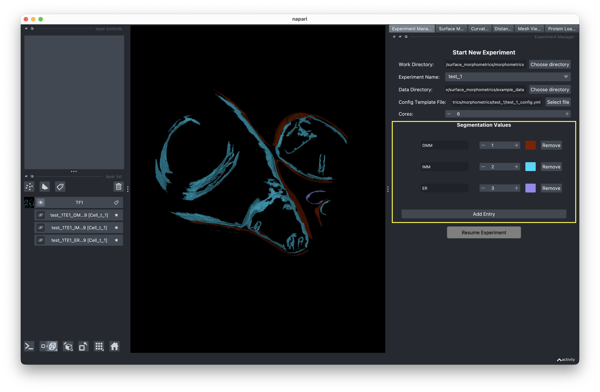

# Experiment Setup

Before running any analysis, you need to create an experiment. This sets up the directory structure and configuration file that the pipeline uses.

<!-- IMAGE NEEDED: Screenshot of the experiment manager panel on the right side of the GUI, showing all input fields: Work Directory browse button, Experiment Name text field, Data Directory browse button, Config Template File browse button, Cores spin box, and the New Experiment button at the bottom -->

## What you provide

| Field | Description |
|-------|-------------|
| **Work Directory** | Parent folder where experiment folders are created |
| **Experiment Name** | Name for your experiment (becomes a subfolder) |
| **Data Directory** | Folder containing your input segmentation files |
| **Config Template** | A YAML configuration template |
| **Cores** | Number of CPU cores for parallel processing |

The **New Experiment** button enables once all fields are filled in and the config template is a `.yml` or `.yaml` file.

## Creating a new experiment

1. Choose a **Work Directory**.
2. Enter a unique **Experiment Name**.
3. Select your **Data Directory**.
4. Pick a **Config Template File**. The template is read and the UI (including segmentation values) is populated so you can review and edit before creation.
5. Set the number of **Cores**.
6. Review the **Segmentation Values** — these are populated from the template but should be edited to match your data.
7. Click **New Experiment**.

### What happens under the hood

- A folder named after your experiment is created inside the work directory.
- The config template is copied into that folder as `<experiment_name>_config.yml`.
- The copied config is populated with your settings: `data_dir`, `work_dir`, `exp_name`, `cores`, `segmentation_values`, and `script_location`.

!!! warning "Config template location matters"
    The GUI automatically detects the location of the analysis scripts based on where your config template file is located. **Keep your config template inside the `surface_morphometrics` directory** (the repository containing the pipeline scripts). If you move the config file elsewhere, the GUI will not be able to find the scripts.

## Segmentation values

The segmentation values section lets you define label–value pairs for your membrane classes. These are written into the config file and used throughout the pipeline.

When you select a config template, the GUI auto-populates these values from the template's defaults. Review and update them to match your specific dataset before creating the experiment.

<!-- IMAGE NEEDED: Screenshot of the segmentation values section showing the label-value pair rows (e.g., "OMM: 1", "IMM: 2") that appear after loading a config template, with the editable fields where users can modify labels and values -->

