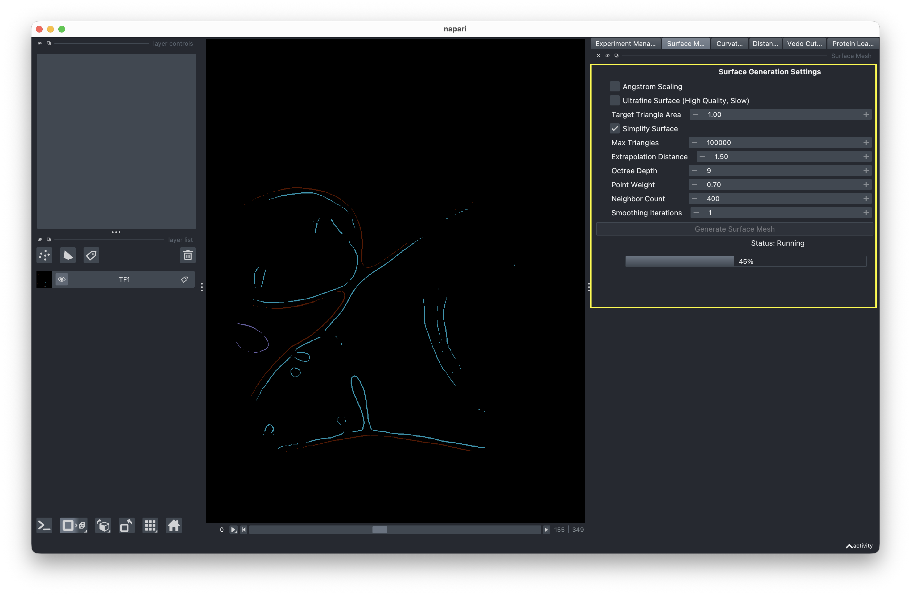
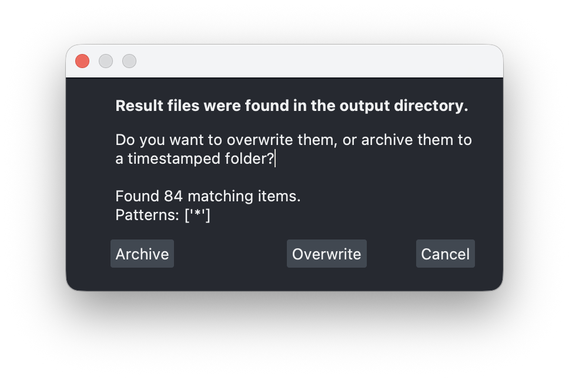

# Surface Mesh Generation

This step converts your voxel segmentations into surface meshes using screened Poisson reconstruction.

<!-- IMAGE NEEDED: Screenshot of the Mesh Generation tab showing the settings panel (reconstruction depth, surface quality parameters) on the right, and the Run button with the progress bar below it -->

## Running mesh generation

1. Switch to the **Mesh Generation** tab.
2. Review the mesh generation settings on the right-hand side. These control parameters like reconstruction depth and surface quality.
3. Click **Run** to start generating meshes for all segmentations in your data directory.

Progress is displayed in the progress bar as each segmentation is processed.

## Output

Generated meshes are saved in your experiment's results directory as `.ply` and `.surface.vtp` files. These VTP files are used in the next step (curvature analysis).

## Rerunning mesh generation

If you run mesh generation on an experiment that already has results, you'll be prompted to choose:

- **Overwrite** — Deletes existing mesh files and runs fresh.
- **Archive** — Moves existing files to a timestamped archive folder (e.g., `results/archive_20241208_120000/`) with a snapshot of the current config, then runs fresh.
- **Cancel** — Aborts the run.

This ensures you never accidentally lose previous results when re-trying with different parameters.

