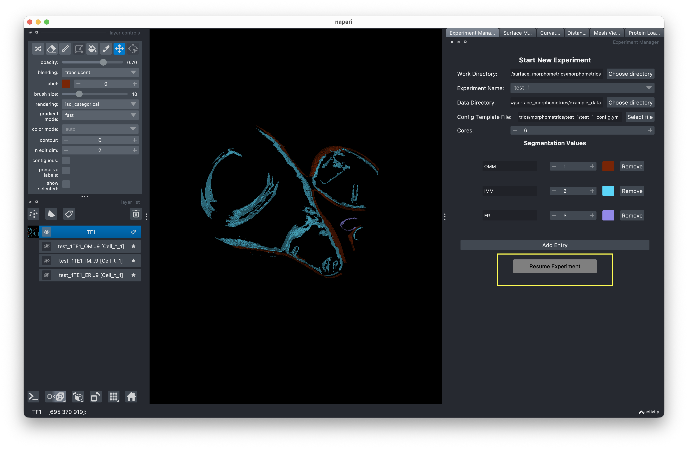

# Resuming Experiments

You can resume a previously created experiment to continue analysis or rerun steps with different parameters.

<!-- IMAGE NEEDED: Screenshot of the experiment manager panel showing the "Resume Experiment" button (instead of "New Experiment") after selecting an existing experiment folder that contains a config file -->

## How to resume

1. Set the **Work Directory** to the parent folder containing your experiment.
2. Select an existing **Experiment Name** — one whose folder contains a `*_config.yml` or `config.yml` file.
3. The button switches to **Resume Experiment**. Click it to load the experiment.

## What gets loaded

When you resume, the GUI loads the experiment's config file and restores:

- **Data directory** and **work directory** paths
- **Config template** reference (or uses the experiment config if not set)
- **Cores** setting
- **Segmentation values**
- **Script location**

Each analysis tab also updates its state:

| Tab | On Resume |
|-----|-----------|
| **Mesh Generation** | Reads mesh settings from config. Checks for existing `.ply`, `.surface.vtp`, or `.xyz` files to determine completion status. |
| **PyCurv** | Resets to ready state. Repopulates the VTP file list by scanning the experiment directory. |
| **Distance & Orientation** | Resets to ready state. Loads distance and orientation measurement settings from config. |

## Rerunning jobs

When you run a job on an experiment that already has results, you're prompted to choose:

- **Overwrite** — Deletes old result files and runs fresh.
- **Archive** — Moves old files to a timestamped folder (e.g., `results/archive_20241208_120000/`) with a config snapshot, then runs fresh.
- **Cancel** — Aborts the run.

This prevents accidental data loss when iterating on parameters.
