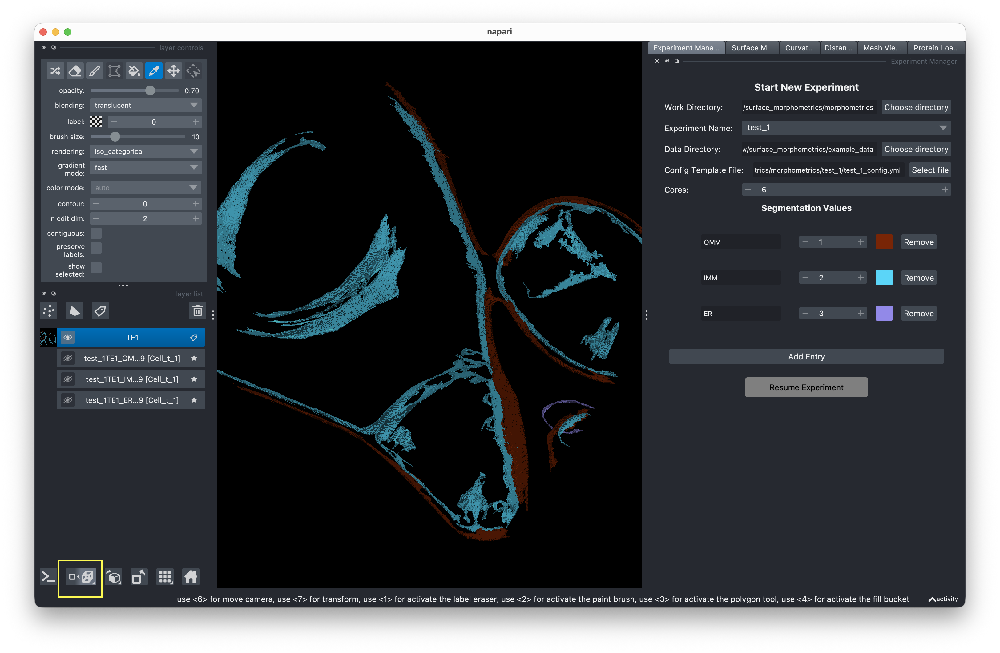
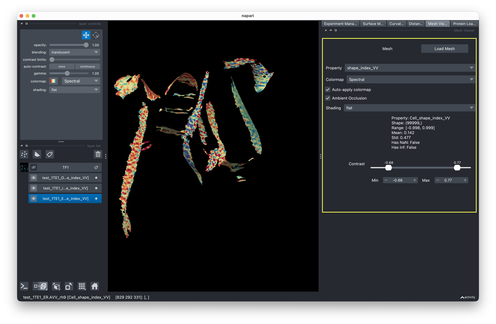

# Visualization

The visualization panel (left side of the GUI) lets you preview your data, view meshes in 3D, and map quantification results onto surfaces.

## Dataset preview

When you set up an experiment, a segmentation slice from your data directory is automatically displayed. This lets you verify you're working with the correct dataset.

<!-- IMAGE NEEDED: Screenshot of the visualization panel showing a 2D tomogram slice from the segmentation data, displayed as a grayscale image in the left panel of the GUI -->

## Viewing meshes in 3D

After running mesh generation:

1. In the visualization panel, use the mesh loader to select a mesh file.
2. Click the **"n display"** button in the lower left to enter 3D rendering mode.
3. Click and drag to rotate the view around the mesh.

<!-- IMAGE NEEDED: Screenshot of a 3D rendered surface mesh in the visualization panel, showing a membrane surface that the user can click and drag to rotate -->

## Property visualization

After running curvature analysis or distance measurements, you can map quantified properties onto the 3D surface:

1. Load a mesh that has been processed (contains quantification data).
2. Use the **dropdown menu** to select which property to visualize (e.g., Gaussian curvature, mean curvature, distance).
3. Use the **slider** to adjust the contrast range of the colormap.

Different properties are displayed as colormaps on the 3D surface, letting you visually identify regions of interest.

<!-- IMAGE NEEDED: Screenshot of a 3D mesh colored by a curvature property (e.g., Gaussian curvature), showing the color gradient across the surface with the property dropdown and contrast slider visible in the panel -->

## Protein Loader

The Protein Loader tab lets you overlay structural data (e.g., ribosomes) onto your meshes.

1. **Load MRC File** — Load the protein structure file.
2. **Load STAR File** — Load the file containing position coordinates and orientations.
3. Select a tomogram layer in the left panel.
4. Click **Extract Coordinates** to retrieve structure positions for the selected tomogram.
5. Click **Show Structure** to display the structures positioned and oriented on the mesh surface.

<!-- IMAGE NEEDED: Screenshot of the Protein Loader tab showing loaded MRC and STAR files, with 3D protein structures (e.g., ribosomes) rendered on the mesh surface in their correct positions and orientations -->
