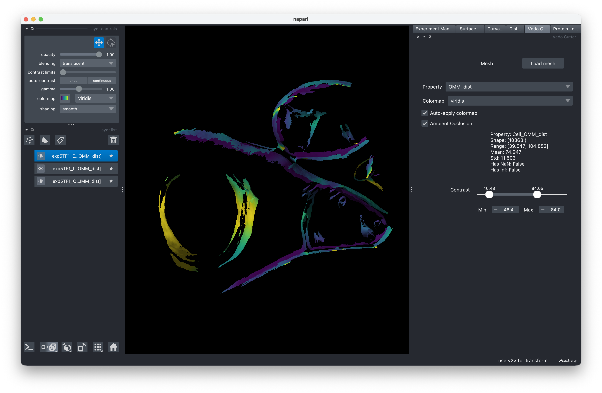

# Surface Morphometrics GUI

A graphical interface for analyzing membrane ultrastructure in cryo-electron tomography data. Built on top of the [surface morphometrics pipeline](https://github.com/GrotjahnLab/surface_morphometrics) by Barad et al.

<!-- IMAGE NEEDED: Screenshot of the full GUI window showing the left visualization panel and right experiment manager panel side by side, with an experiment loaded and a mesh displayed -->

## What it does

Surface Morphometrics GUI lets you run the full surface morphometrics pipeline without touching the command line. Load your cryo-ET segmentations, generate surface meshes, measure curvature and distance quantification, and visualize results, all from one interface.

## Get started

- **[Installation](getting-started/installation.md)** — Set up the pipeline and GUI
- **[Quick Start](getting-started/quickstart.md)** — Run your first analysis end-to-end

## User Guide

Step-by-step guidance for each stage of the workflow:

1. [Experiment Setup](guide/experiment-setup.md) — Configure your experiment
2. [Surface Mesh Generation](guide/mesh-generation.md) — Generate meshes from segmentations
3. [Curvature Analysis](guide/curvature-analysis.md) — Run curvature analysis
4. [Distance & Orientation](guide/distance-orientation.md) — Measure inter/intra-membrane distances
5. [Visualization](guide/visualization.md) — View meshes, properties, and protein structures in 3D
6. [Resuming Experiments](guide/resuming-experiments.md) — Pick up where you left off

## Learn more

- [About Surface Morphometrics](about.md) — Background and references
- [Original pipeline repository](https://github.com/GrotjahnLab/surface_morphometrics)
