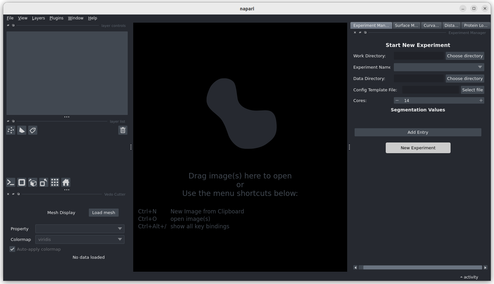
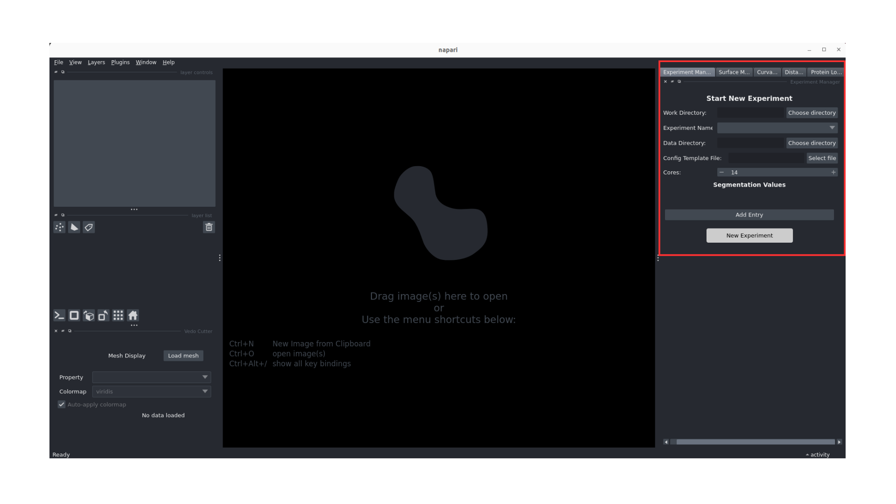

# Pipeline Tutorial

This tutorial will guide you through the complete workflow of using the Surface Morphometrics GUI.

## Prerequisites

Before starting this tutorial, make sure you have:
- Successfully installed the Surface Morphometrics GUI (see [Installation Guide](../index.md))

## Getting Started

### Step 1: Activate the Environment

Activate the conda environment that was created during installation. If you successfully activated the environment, you should see the name of the environment (`(morphometrics)`) to the left of your prompt.

```bash
conda activate morphometrics
```

### Step 2: Launch the GUI

Launch the GUI from the command line using the command below.

```bash
# Enter the surface morphometrics GUI directory and navigate to source directory
cd surface-morphometrics-gui/src
# Launch GUI
python main.py
```



### Step 3: Create a New Experiment

Once the GUI is loaded, you'll see the experiment manager panel on the right side. Here's how to set up a new experiment:

1. **Work Directory**: Select a location where all experiment-related data and results will be saved. For best results, create a new folder inside the surface-morphometrics directory and set that as your Work Directory.
2. **Experiment Name**: Give your experiment a descriptive name
3. **Data Directory**: Select the location of your dataset that you want to analyze with surface morphometrics
4. **Config Template**: Choose the master configuration template (this will be edited through the GUI for your specific experiment)
5. **Core**: Select the number of CPU cores you want to use for processing

After filling in all the required fields, click the **"New Experiment"** button to create your experiment.



### Step 4: Surface Reconstruction

The system will now run surface reconstructions for all the segmentations from the provided data directory. 

On the right-hand side, you'll see a highlighted tab where you can edit the configuration related to surface mesh generation. This is where you can adjust parameters that control how the surface meshes are generated from your segmentation data.


### Step 5: Running Pycurv for Each Surface

The system now runs Pycurv analysis for each generated surface. This step utilizes parallel processing based on the number of cores you specified during experiment setup.

**Processing Options:**
 
- **Run on All**: Process all surfaces simultaneously using available cores
- **Run One by One**: Process surfaces sequentially

**Core Utilization:**
- If utilizing maximum cores, additional files will be placed on standby
- As each analysis completes, the next file in the queue automatically begins processing


### Step 6: Measure Intra-Inter Surface Distances and Orientations

In this step, the system measures the intra-inter surface distances and orientations between the analyzed surfaces.
- Adjust the measurement parameters as needed for your specific analysis requirements
- Configure distance thresholds and tolerance

